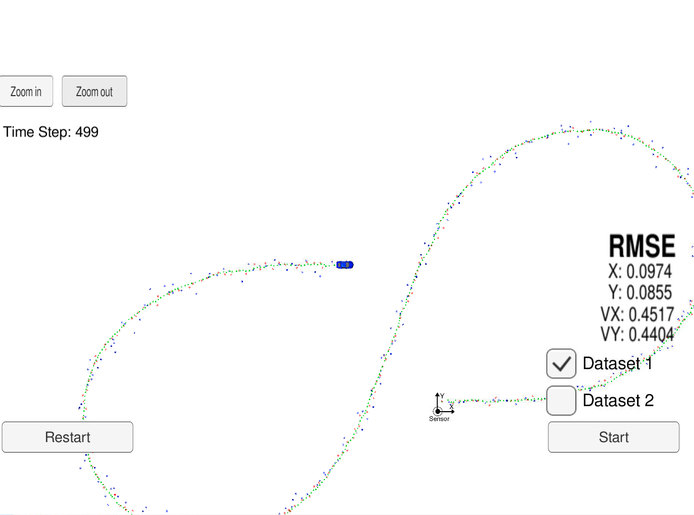
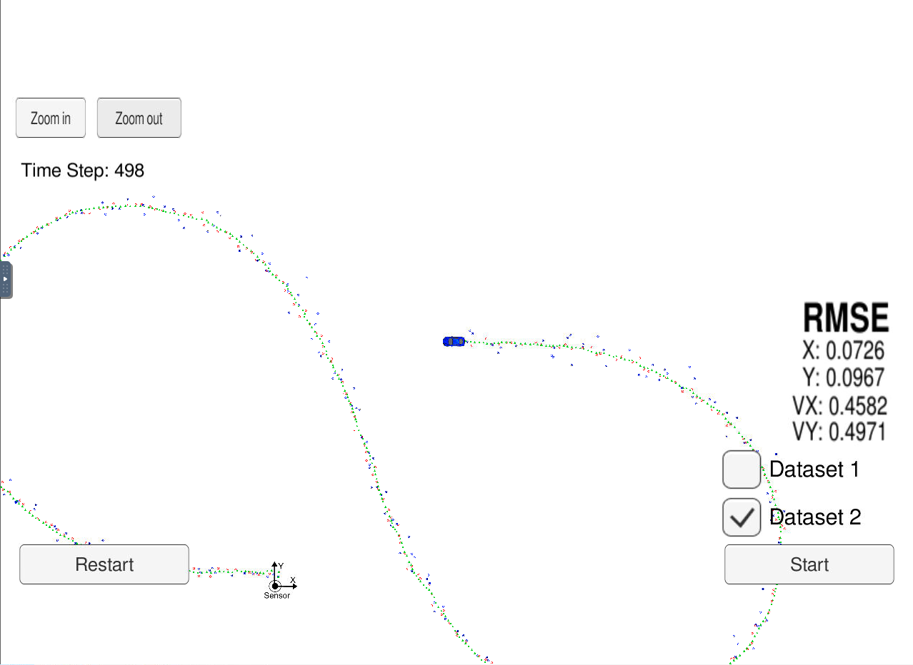

# Extended Kalman Filter Project Starter Code
Self-Driving Car Engineer Nanodegree Program

In this project I have utilize a kalman filter to estimate the state of a moving object of interest with noisy lidar and radar measurements.

This project involves the Term 2 Simulator which can be downloaded [here](https://github.com/udacity/self-driving-car-sim/releases).

The goal of this project is to build an Extended Kalman Filter using C++ and use it to estimate the state of a moving object of interest with noisy LIDAR and RADAR measurements.

The key metrics are RMSE values for both position and velocity of the tracked object.

## Expected Results :

The success metrics for this project is the RMSE values for 2 datasets.

The threshold for the values should be as below:

* 0.11 less than or equal to Px and Py.
* 0.52 less than or equal to Vx and Vy.

## RMSE Values :

The following table lists the results of both datasets on which the algorithm has been tested.

## Introduction :

This project utilizes an EKF (Extended Kalman Filter) implemented in C++ to estimate the state of a moving object using noisy LIDAR and RADAR data measurements passed via a simulator. Here's a great resource to get up to speed with the basics of a Kalman Filter.

## Implementation :

├── FusionEKF.cpp
├── FusionEKF.h
├── json.hpp
├── kalman_filter.cpp
├── kalman_filter.h
├── main.cpp
├── measurement_package.h
├── tools.cpp
└── tools.h

* main.cpp - reads in data, runs the Kalman filter and calculates RMSE values after each measurement.

* FusionEKF.cpp - initializes the filter, calls the Predict function and the Update function.

* kalman_filter.cpp - implementation of the Predict and Update function, for both LIDAR and RADAR.

* tools.cpp - tool functions to calculate RMSE and the Jacobian matrix, used to convert polar to cartesian coordinates.

## Project Working and results :

| RMSE					|     Dataset 1 			| Dataset 2			| 
|:---------------------:|:--------------------------|------------------:| 
| Px					| 0.0974					|   0.0726			| 
| Py					| 0.0855					|   0.0967			| 
| Vx					| 0.4517					|   0.4582			| 
| Vy					| 0.4404					|   0.4971			| 

As you can see the values of Px, Py and Vx, Vy are well within the result limits specified to say that this algorithm has meet the specifications. 

Input data for both the datasets include input data consisting of LASER measurements (given directly as x-y points, with some uncertainties) and RADAR measurements (given as radius, angle and radial velocity relative with some known uncertainty) are combined with a motion model to track a vehicle with much better accuracy than the individual measurements.

The code presented here is designed to work with Udacity term 2 simulation executable and so cannot run standalone. Following are some screenshots of the simulation results obtained:

Dataset 1 results :

Dataset 2 results :

In the above figures, 

Red circles indicate LIDAR measurements.

Blue circles are RADAR measurements (position markers inferred from radius and angle).

Green markers are the car's position as estimated by the Kalman Filter.

From these results we can say that, Kalman filter does a good job of tracking the car's position with significantly reduced noise.

## Dependencies :

* cmake >= 3.5
    * All OS: [Click here for installation instructions](https://cmake.org/install/)
* make >= 4.1 (Linux, Mac), 3.81(Windows)
    * Linux: make is installed by default on most Linux distros.
    * Mac: [install Xcode command line tools to get make](https://developer.apple.com/xcode/features/).
    * Windows: [Click here for installation instructions](http://gnuwin32.sourceforge.net/packages/make.htm).
* gcc/g++ >= 5.4
    * Linux: gcc/g++ os installed by default on most Linux distros.
    * Mac: same deal as make - [install Xcode command line tools](https://developer.apple.com/xcode/features/)
    * Windows: recommend using [MinGW](http://www1.mingw.org/?tm=1&subid4=1629570797.0308880000&kw=compiler&KW1=Windows%20Development%20Software&KW2=C%20Compiler&KW3=Windows%20Server%20Virtual%20Machine&searchbox=0&domainname=0&backfill=0).
    
## Build :

1. Clone this repo.
2. Make a build directory: mkdir build && cd build
3. Compile: cmake .. && make
    * On windows, you may need to run: cmake .. -G "Unix Makefiles" && make
4. Run it: ./ExtendedKF
5. Start the Simulator and wait for connection to be established between ExtendedKF and Simulator.

## Conclusion :

A standart Kalman Filter can only handle linear equations. Extended Kalman Filter (EKF) allows us to use non-linear equations, EKF uses Jacobian matrix to linearize non-linear functions. There is another type, Unscented Kalman Filter (UKF) which is also allows us to use non-linear equations, in UKF, it does not need to linearize non-linear functions, instead, UKF takes representative points from a Gaussian distribution.

This project demonstrates the value of an EKF which is able to take noisy measurements from multiple sensor types and generate a state estimation more accurate than estimations from individual sensors by combining the Gaussian probability distributions of the measurements with its own prediction of where the tracked object is located.